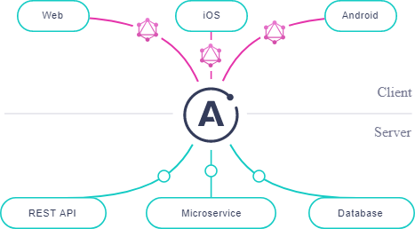

# GraphQL

GraphQL is a language used to provide structure and type information to our entity data.
Regardless of which vendor's implementation of GraphQL is used on the server, our client can expect the same data structures to be returned.

Main characteristics:
1. GraphQL is a data schema standard developed by Facebook.
2. GraphQL works across platforms, frameworks, and languages.
3. GraphQL returns control for what is queried to the caller.

Two main uses of a GraphQL endpoint:
1. Gateway to consolidate other data services.
2. As the main web API service that directly receives data from a datastore and provides it to clients

## What is Apollo Server?
Apollo Server is an open-source, spec-compliant GraphQL server that’s compatible with any GraphQL client, including Apollo Client. It’s the best way to build a production-ready, self-documenting GraphQL API that can use data from any source.

